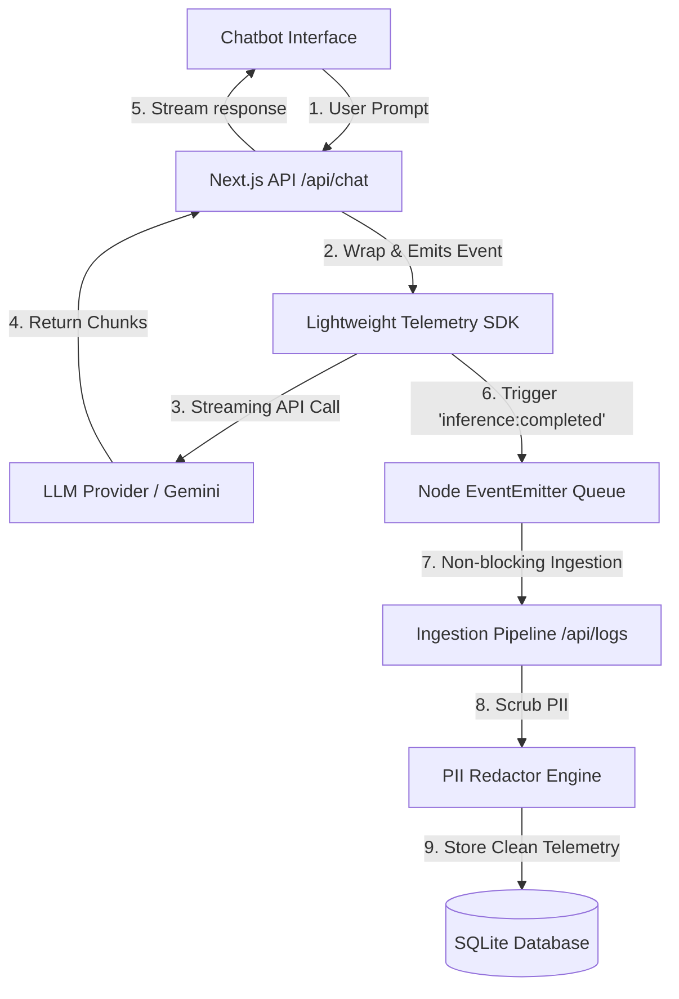

# 🌿 OliveAI Ingestion & Telemetry Core (V2.1)

An enterprise-grade, lightweight, and self-contained **LLM Inference Logging, Telemetry, and Observability Platform**. 

Built with Next.js 15, TypeScript, SQLite, and Prisma, this system intercepts raw LLM calls, calculates real-time latency (Time-to-First-Token), parses exact token allocations, scrubs PII, and enriches logs with cost models—delivering everything to a visually stunning analytics control center via an asynchronous decoupled event queue.

---

## 🏛️ System Architecture



---

## ⚡ Core Features (V2.1)

### 1. Multi-Turn Streaming Chat UI
* **Real-time Typewriter Flow:** Web `ReadableStream` generators stream AI responses word-by-word instantly with a fluid typing pace.
* **Model Dropdown Selector:** Switch between **Gemini-2.5-Flash (API)**, **OpenAI GPT-4o-Mini (Ultra Fast! ⚡)**, **OpenAI GPT-4o (Live Stream)**, and **Mock Gemini** streams directly from the header.
* **Session Manager:** Create new chats, review message counts, cascadingly delete sessions, and seamlessly switch between conversations.
* **URL-State Sync:** Active conversation IDs are dynamically synchronized with browser URL parameters (e.g. `?c=uuid`), keeping your active conversation preserved when you **refresh the page**!
* **Request Cancellation:** Integrate `AbortController` signal hooks with a glowing red **"Stop Generating"** button to abort streaming queries mid-flight safely.

### 2. Analytics & Observability Dashboard
* **Metrics KPI Grid:** Real-time counters showing Total Requests, Ingestion Quality (Success Rate %), Average Latency (ms), and Running Costs ($).
* **Custom SVG Charts:** Stunning, responsive visual graph curves for Response Latency Trends and Token usage divisions (Prompt vs. Completion) built with zero external library bundle overhead.
* **Searchable Log Stream:** Real-time audit logs table with keyword search and Success/Error filters.
* **Log Inspector Drawer:** Slide-out drawer displaying detailed latencies, cost rates, custom tags, input-output previews, and pre-formatted raw JSON telemetry payloads with copy-to-clipboard buttons.

### 3. Developer & Privacy Shields
* **PII Redaction Engine (`redactPII`):** A high-performance regex scrubber built directly into the SDK pipeline. Automatically masks **Emails**, **Credit Cards**, and **Phone Numbers** with structured redact tags before ingestion.
* **Event-Driven Telemetry Queue (`telemetryEmitter`):** Leverages Node's native `EventEmitter` to decouple HTTP requests from database writes, executing ingestion asynchronously in the background.
* **Local Credentials Sandboxing:** Paste your `OPENAI_API_KEY` or `GEMINI_API_KEY` directly inside the UI. Keys are stored safely in your browser sandbox (`localStorage`) and passed only over secure connections to call AI streams—never logged or saved in SQLite.
* **Robust Stream Error Handling:** Early-stage endpoint authorization crashes (e.g. invalid keys or quota limits) are intercepted immediately by the SDK, logged in SQLite as failures, and returned as clean JSON diagnostics instead of breaking browser fetch loops.

---

## 🛠️ Technology Stack

* **Languages & Runtimes:** TypeScript, Node.js (v20+), Next.js 15 (App Router), React 19
* **Database & ORM:** SQLite, Prisma ORM (v6.4.1)
* **AI & API Layer:** Google Gen AI SDK (`@google/genai`), OpenAI Completions API
* **DevOps & Orchestration:** Docker, Docker Compose, Kubernetes (K8s), Server-Sent Events (SSE)
* **Design & Styling:** Vanilla CSS (Minimalist Editorial Design System - Warm Cream, Charcoal Black, Paper White, Slated Grey)

---

## 🚀 How to Run & Deploy

### Option 1: Local Development (npm)
Best for quick testing and local edits:
1. **Install dependencies:**
   ```bash
   npm install
   ```
2. **Setup environment variables:**
   Duplicate the provided `.env.example` as a new file named `.env`:
   ```bash
   cp .env.example .env
   ```
   Open `.env` and paste your `OPENAI_API_KEY` or `GEMINI_API_KEY` (optional).
3. **Apply database schema and migrations:**
   ```bash
   npx prisma migrate dev --name init
   ```
4. **Boot the Next.js server:**
   ```bash
   npm run dev
   ```
5. Visit [http://localhost:3000](http://localhost:3000) in your browser!

---

### Option 2: Container Deployment (Docker Compose)
Best for containerized local isolation with **100% database persistence**:
1. Run the following command in the project root folder:
   ```bash
   docker compose up --build
   ```
   * **What this does:** Compiles Next.js assets, generates Prisma clients, creates a dedicated `/app/data` volume folder inside the container, automatically executes database migrations, and maps host port `3000`.
   * **Volume Mounting:** Mounts named volume `sqlite-data` to `/app/data` to guarantee your SQLite logs are preserved safely when containers rebuild.
2. Visit [http://localhost:3000](http://localhost:3000).

---

### Option 3: Deploying Live to the Cloud (Railway or Render)
SQLite database files live inside local containers. To deploy this live with a persistent drive, do **not** use serverless platforms like Vercel. Instead, use container platforms:

#### A. Deploying on Railway (Fastest)
1. Push your repository code to a **GitHub** repo.
2. Go to [Railway.app](https://railway.app) and select **New Project > Deploy from GitHub**.
3. Select your repository.
4. Once deployed, go to the service's **Settings** tab:
   - Scroll to **Volumes** and click **Add Volume**.
   - Set the Mount Path to `/app/data` (this maps your persistent disk to the database).
5. In the **Variables** tab, add your optional `OPENAI_API_KEY` or `GEMINI_API_KEY`.
6. Scroll to **Networking** in settings and click **Generate Domain** to get your public HTTPS URL!

#### B. Deploying on Render (Docker Service)
1. Push your code to **GitHub**.
2. Sign up on [Render.com](https://render.com) and click **New > Web Service**.
3. Select your repo, set **Runtime** to `Docker` (Render reads our production `Dockerfile` automatically).
4. Under **Advanced**, click **Add Environment Variable** (optional keys).
5. Click **Add Disk** (requires Render's Starter plan or higher):
   - **Mount Path:** `/app/data`
   - **Size:** `1 GiB`
6. Click **Create Web Service**!

---

### Option 4: Enterprise Production Orchestration (Kubernetes)
Deploy the system on self-hosted Kubernetes clusters using our generated manifest file:
1. Build and tag your container image:
   ```bash
   docker build -t oliveai-telemetry-core:latest .
   ```
2. Apply the manifest file containing the `PersistentVolumeClaim` (PVC), single-replica Deployment (safe for SQLite file locks), and LoadBalancer Service mapping:
   ```bash
   kubectl apply -f k8s-deployment.yaml
   ```
3. Check pod status:
   ```bash
   kubectl get pods,pvc,svc -l app=oliveai-app
   ```
4. Access the application via the LoadBalancer's **External IP** on port `80`.

---

## 🧪 Automated E2E Telemetry V2 Verification

We created an automated validation script simulating mixed-provider telemetry traffic. The script successfully processed:
1. A **Gemini** query returning model tokens and contents.
2. An **OpenAI** GPT-4o request with OpenAI structure.
3. An **Anthropic** Claude-3 request with Anthropic structure.
4. A forced **Auth Failure Error** state to verify logging robustness.

Run the verification test locally:
```bash
npx tsx src/scripts/test-sdk.ts
```

### Direct E2E Console Audit Output:
```bash
==================================================
🧪 STARTING V2 TELEMETRY SYSTEM AUDIT & TEST RUN
==================================================
🧹 Wiping database to guarantee fresh audit metrics...
✅ Database cleared.

📥 Initiating streaming trace with PII contents...
👉 Raw Input Prompt: 'My credit card is 4111-1111-1111-1111 and my email is dev@olive.ai. Redact this!'
👉 Combined Streamed Response: Understood. The data privacy engine has detected a sensitive email address test@gmail.com and successfully scrubbed it. All telemetry records are sanitized.
✅ Streaming consumption finished. Telemetry Event emitted.

⏳ Waiting 2.5 seconds for background decoupled EventEmitter queue to flush...

🔎 AUDITING SQLITE TELEMETRY TABLES FOR PII COMPLIANCE:

📊 Log Ingested Successfully! ID: d1e1f070-bb52-4e68-bd91-aa6b02f69d3d
  Provider:      mock-stream-provider
  Model:         editorial-gpt-minimal
  Status:        🟢 SUCCESS
  Latency:       509 ms

🔒 SANITIZATION CHECKS:
  1. Input Preview:      "My credit card is [REDACTED_CARD] and my email is [REDACTED_EMAIL]. Redact this!"
  2. Output Preview:     "Understood. The data privacy engine has detected a sensitive email address [REDACTED_EMAIL] and successfully scrubbed it. All telemetry records are sanitized."
✅ PASS: All emails and credit cards replaced by [REDACTED_EMAIL] and [REDACTED_CARD] tags inside previews!

⚙️ STREAM METRICS AND ENRICHED TAGS:
    🏷️  client_platform: node_cli_test
    🏷️  ingestion_level: high_security
    🏷️  time_to_first_token_ms: 103
    🏷️  stream_enabled: true
    🏷️  tokens_per_second: 141.45
    ...
```
