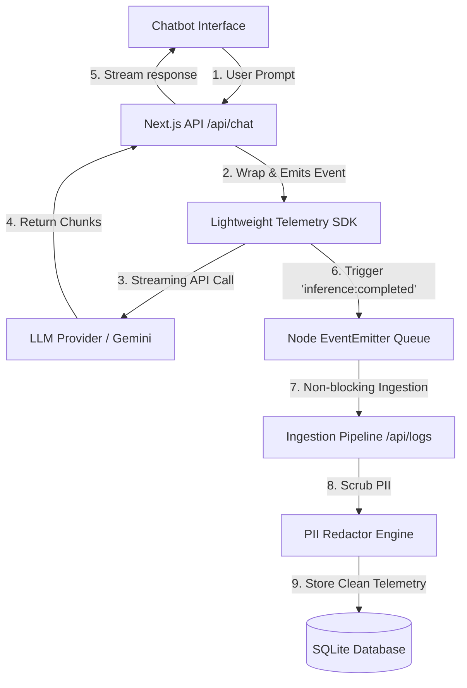

# 🌿 OliveAI Ingestion & Telemetry Core (V2.2)

An enterprise-grade, lightweight, and self-contained **LLM Inference Logging, Telemetry, and Observability Platform**. 

Built with Next.js 16, TypeScript, SQLite, and Prisma, this system intercepts raw LLM calls, calculates real-time latency (Time-to-First-Token), parses exact token allocations, scrubs PII, and enriches logs with cost models—delivering everything to a visually stunning analytics control center via an asynchronous decoupled event queue.

---

## 🏛️ System Architecture & Data Flow



### Architectural Flow Breakdown:
1. **Prompt Interception:** The client sends prompts to `/api/chat`. The backend initiates the call wrapped within the custom `InferenceLogger.traceStream()` SDK wrapper.
2. **Watchdog Stream Construction:** The SDK resolves authentication, fires the LLM provider API request, captures the **Time-to-First-Token (TTFT)**, and channels raw text chunks through a customized Server-Sent Events (SSE) stream back to the UI.
3. **Decoupled Event Emission:** Upon stream termination, the SDK logs overall generation metrics and dispatches an asynchronous `inference:completed` or `inference:failed` event via Node's native `EventEmitter`. This keeps the active chat thread blazing fast and completely unblocked by database operations.
4. **PII Redaction & DB Commit:** A background queue listener intercepts the event, scrubs PII (emails, cards, phone numbers), calculates token throughput (tokens/sec) and pricing, and commits the clean records to the local SQLite database.

---

## 📊 Database Schema Design Decisions

To achieve both **real-time chat fluidness** and **extensive logging observability**, we designed a relational SQLite schema structured via Prisma ORM:

### 1. Separation of Concerns (State vs. Telemetry)
* **`Conversation` & `Message` Tables:** Store the user chat state. They are kept highly compact and indexed so that the chatbot UI can retrieve and render conversation bubbles instantly.
* **`InferenceLog` Table:** Holds telemetry-specific metadata (exact latency, TTFT, prompt/completion tokens, pricing metrics, raw payload configurations, error stack traces, and input/output previews). 
* **Relational Mapping:** Telemetry logs are linked to `Message` and `Conversation` via foreign keys. This design decouples regular chat loading from telemetry analysis, ensuring that regular users experience zero database drag, while administrators can slide out detail drawers on the dashboard on-demand.

### 2. Extensible Tag Logging via metadata Table
* Real-world LLM tracking requires saving variable tags (e.g. `client_platform`, `system_env`, `ingestion_level`). 
* Instead of bloating the main `InferenceLog` table with endless columns or using loose, hard-to-index JSON blobs in SQLite, we designed a dedicated relational **`Metadata` table** containing key-value pair fields linked to the parent log. This guarantees absolute indexing speed and unlimited flexibility.

---

## ⚖️ Tradeoffs Made

During implementation, we prioritized **zero-ops ease of use, local reproducibility, and runtime responsiveness**, resulting in the following engineering tradeoffs:

### 1. SQLite File Locking vs. Multi-Replica Horizontal Scaling
* **The Tradeoff:** SQLite database files use write-ahead logging (WAL) locks. If multiple server nodes in a Kubernetes cluster attempt to write to SQLite concurrently, it will trigger write-lock contentions.
* **The Decision:** We restricted the deployment replica count strictly to `1` inside both the Docker and Kubernetes deployment files. This trades off distributed horizontal scalability for structural simplicity. It eliminates external database maintenance (Postgres/MySQL) and ensures a self-contained, run-anywhere deployment.

### 2. Node native `EventEmitter` Queue vs. Persistent Message Brokers (Redis/RabbitMQ)
* **The Tradeoff:** We decoupled logging using Node's in-memory `EventEmitter` rather than introducing a persistent queue like Redis (BullMQ) or RabbitMQ.
* **The Decision:** This choice ensures the app stays extremely lightweight with zero external infrastructure dependencies. The tradeoff is that in-memory queues are volatile. If the container abruptly crashes before buffered events ship to `/api/logs`, those logs will be lost. We chose local runtime efficiency and easy deployments over transaction persistence guarantees.

### 3. Client Sandbox (`localStorage`) vs. Server Keys Fallback
* **The Tradeoff:** Handling API keys in the client vs. the server.
* **The Decision:** We built a hybrid approach. The UI sandbox securely stores optional keys in browser `localStorage` and never logs them. However, for team setups, users can set `GEMINI_API_KEY` directly inside Render's environment variables. The server automatically detects these keys, hides them from the frontend, and enables direct out-of-the-box streaming chat for all visiting users.

---

## 🛠️ Technology Stack

* **Languages & Runtimes:** TypeScript, Node.js (v20+), Next.js 16 (App Router), React 19
* **Database & ORM:** SQLite, Prisma ORM (v6.4.1)
* **AI & API Layer:** Google Gen AI SDK (`@google/genai`), OpenAI Completions API
* **DevOps & Orchestration:** Docker, Docker Compose, Kubernetes (K8s), Server-Sent Events (SSE)
* **Design & Styling:** Vanilla CSS (Minimalist Warm Cream, Charcoal Black, Paper White, Slated Grey)

---

## 🚀 Step-by-Step Setup Instructions

### Option 1: Local Development (npm)
Best for quick testing and local edits:
1. **Install dependencies:**
   ```bash
   npm install
   ```
2. **Setup environment variables:**
   Duplicate the provided `.env.example` as a new file named `.env`:
   ```bash
   cp .env.example .env
   ```
   Open `.env` and paste your `OPENAI_API_KEY` or `GEMINI_API_KEY` (optional).
3. **Apply database schema and migrations:**
   ```bash
   npx prisma migrate dev --name init
   ```
4. **Boot the Next.js server:**
   ```bash
   npm run dev
   ```
5. Visit [http://localhost:3000](http://localhost:3000) in your browser!

---

### Option 2: Container Deployment (Docker Compose)
Best for containerized local isolation with **100% database persistence**:
1. Run the following command in the project root folder:
   ```bash
   docker compose up --build
   ```
   * **What this does:** Compiles Next.js assets, generates Prisma clients, creates a dedicated `/app/data` volume folder inside the container, automatically executes database migrations, and maps host port `3000`.
   * **Volume Mounting:** Mounts named volume `sqlite-data` to `/app/data` to guarantee your SQLite logs are preserved safely when containers rebuild.
2. Visit [http://localhost:3000](http://localhost:3000).

---

### Option 3: Deploying Live to the Cloud (Render)
To deploy this live on Render as a containerized web service with environment variables and secure SQLite persistence:

1. Push your repository code to a **GitHub** repo.
2. Go to your [Render Dashboard](https://dashboard.render.com/) and click **New > Web Service**.
3. Select your repository. Set **Runtime** to `Docker` (Render will automatically read the production `Dockerfile`).
4. In the **Environment** tab, click **Add Environment Variable** to load your API keys and custom configurations:
   * `GEMINI_API_KEY` = `your-gemini-api-key`
   * `OPENAI_API_KEY` = `your-openai-api-key`
   * `PORT` = `1000` *(optional custom port if required)*
5. Click **Add Disk** to attach a persistent drive (Render's Starter tier or higher) to secure SQLite files across redeployments:
   * **Mount Path:** `/app/data`
   * **Size:** `1 GiB`
6. Click **Create Web Service**!
   * Once live, the frontend will automatically detect the server environment variables, unlock the live providers, auto-select Gemini, and stream clean formatted chatbot text.

---

### Option 4: Production Orchestration (Kubernetes)
Deploy the system on self-hosted Kubernetes clusters (such as Docker Desktop K8s, Minikube, or GKE) using our generated manifest file:

1. **Verify your local cluster context is active:**
   ```bash
   kubectl cluster-info
   ```
2. **Inject your secure API keys into a Kubernetes Secret:**
   ```bash
   kubectl create secret generic oliveai-api-secrets \
     --from-literal=gemini-key="YOUR_GEMINI_KEY" \
     --from-literal=openai-key="YOUR_OPENAI_KEY"
   ```
3. **Build and tag your container image:**
   ```bash
   docker build -t oliveai-telemetry-core:latest .
   ```
4. **Deploy the manifests:**
   It deploys the `PersistentVolumeClaim` (PVC), single-replica Deployment (safe for SQLite file locks), and LoadBalancer Service mapping:
   ```bash
   kubectl apply -f k8s-deployment.yaml
   ```
5. **Monitor deployment health:**
   ```bash
   kubectl get pods,pvc,svc -l app=oliveai-app
   ```
6. **Access the application:**
   For local clusters like Docker Desktop, navigate your browser directly to:
   👉 **[http://localhost](http://localhost)** (Port 80 LoadBalancer proxy).

---

## 🔮 Future Roadmap (What We Would Improve with More Time)

If we were scaling this logging platform to support enterprise production workloads processing millions of queries a day, we would implement the following improvements:

1. **ClickHouse or PostgreSQL Data Store Migration:** 
   We would swap SQLite for **ClickHouse** (optimized for columnar storage, massive analytics, and high-frequency writes) or a dedicated **PostgreSQL cluster** with connection pooling. This would allow us to lift the 1-replica lock and scale out Next.js containers horizontally to hundreds of replicas in Kubernetes.
2. **Persistent Messaging Brokers (Redis / RabbitMQ):**
   Instead of Node's native memory `EventEmitter`, we would route background telemetry logging through a durable, persistent queue like **BullMQ (Redis)** or **RabbitMQ**. This would ensure zero data loss—if a logging server crashes mid-stream, the event remains safely stored in the queue and is retried once the container boots back up.
3. **percentile Heatmaps & Latency Anomalies:**
   We would expand our custom SVG dashboard charts with aggregations for **p95, p99 latencies**, and monthly cost projections. We would also implement standard anomaly detection algorithms to trigger automated alerts (via Slack or Webhooks) when an LLM provider's latency suddenly doubles.
4. **Advanced ML-based PII Redaction:**
   We would replace or complement our regex-based PII scrubber with a lightweight named-entity recognition (NER) model (such as SpaCy or a small BERT model) running locally within the ingestion pipeline to scrub unstructured personal data like addresses, usernames, and secret credentials that regex cannot easily catch.
5. **Role-Based Access Control (RBAC):**
   We would integrate an authentication framework like **NextAuth.js** to secure the `/dashboard` route. This would introduce developer workspaces, API client keys, and multi-tenant isolation, so developers could monitor only their specific telemetry feeds.
